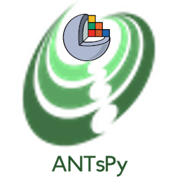
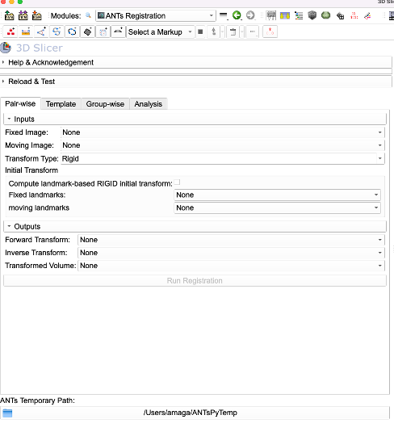

# SlicerANTsPy

## Advanced Normalization Tools (ANTs)
[ANTs](https://github.com/ANTsX/ANTs) is a performant image registration library. An extension that exposes its core Registration functionality is available as part of the Slicer's extension catalog https://github.com/netstim/SlicerANTs

## ANTsPY
The ANTsPy library wraps image processing framework ANTs in Python. It includes reading and writing of medical images, algorithms for registration, segmentation,  statistical learning.  
**SlicerANTsPy** extension makes ANTsPy available inside 3D Slicer, and provides graphical user interface to some of its common functionalities such as interactive registration, batch (group wise) registration, template creation and tensor-based morphometry via Jacobian analysis (WIP). It provides some convenience features such as optionally initializing all registrations via landmarks. Summary of the existing functionality:

* **Pairwise registration:** This is the same interactive registration functionality as the existing SlicerANTs extension. It provides a slightly simplified user interface at the expense of only exposing [predefined set of transforms in ANTsPy](https://antspyx.readthedocs.io/en/latest/registration.html#module-ants). If you need to have full control over the registration, you should use the SlicerANTs extension (or use the ANTsPy from the python console). All data read and written to the Slicer scene.
* **Groupwise registration:** This is the batch registration, in which all input are registered against a reference template. While the reference template (and optionally its landmarks) are loaded from the scene, all inputs and outputs (transforms and registered volumes) are read from and written to the disk.
* **Template:**  This exposes the [`ants.registration.build_template` module from the ANTsPy](https://antspyx.readthedocs.io/en/latest/ants.registration.html#module-ants.registration.build_template) in a GUI setting. The difference from the groupwise registration is that transient transforms and output volumes are not preserved. The only output is the final template (saved into the scene) and intermediate templates (written to the output folder), if more than one iteration is specificed.
* **Analysis (WIP):** This exposes the [`ants.registration.create_jacobian_determinant_image` module](https://antspyx.readthedocs.io/en/latest/ants.registration.html#module-ants.registration.create_jacobian_determinant_image). It requires an a reference template, and an output folder from the Groupwis registration in which subjects are deformably registered to the specified reference template. You need to provide a covariate list and a formula that will calculate the regression coeffiecients based on the jacobians and the specified covariates(s). power 

## Official ANTsPy Documentation
https://antspyx.readthedocs.io/en/latest/

## Funding acknowledgement  
SlicerANTsPy has been made available through funding from  the National Institutes of Health (NICHD/HD104435).

